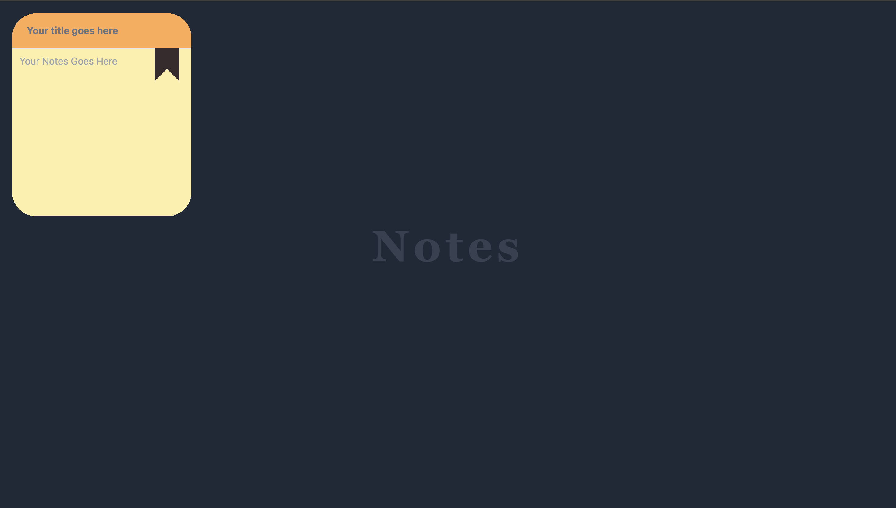
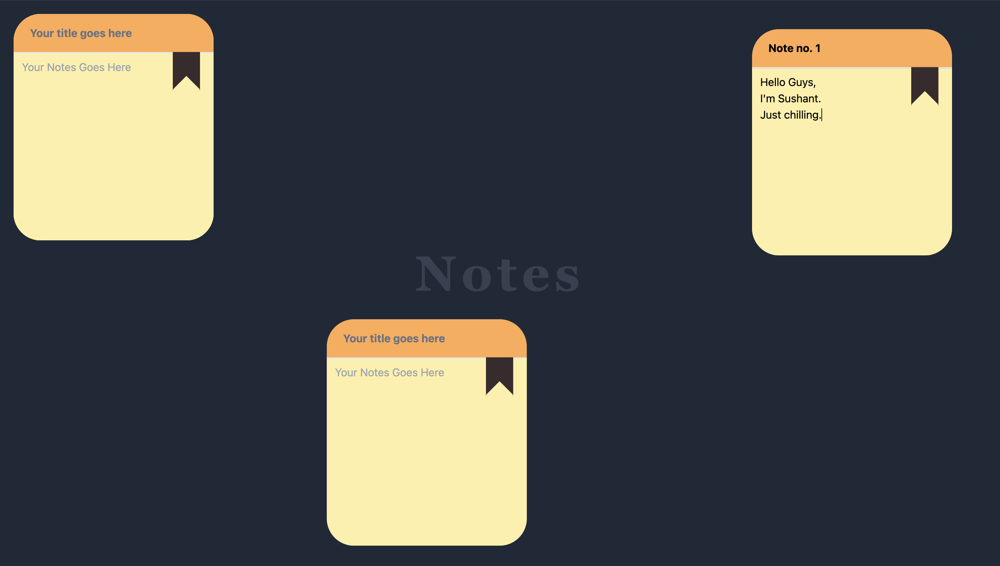

# Notes_App 📝

A dynamic and interactive Notes application built with **React.js**, **Framer Motion**, and **Tailwind CSS**. This app allows users to create, manage, and drag note boxes with animations for a delightful user experience.

## Features 🚀
- **Draggable Notes:** Move notes around the screen with ease.
- **Smooth Animations:** Bumping and smooth transitions powered by Framer Motion.
- **Stylish Design:** Tailwind CSS for modern, responsive styling.
- **Interactive UI:** A visually appealing notes application for productivity or fun.

## Preview 🌟



## Technologies Used 🛠️
- **React.js**: Frontend framework for building the UI.
- **Framer Motion**: For smooth animations and transitions.
- **Tailwind CSS**: Utility-first CSS framework for styling.
- **JavaScript**: Core programming logic.

## How It Works 🔧
- The app creates 10 draggable note boxes.
- Each note box is animated with **Framer Motion** for smooth bump effects.
- Tailwind CSS ensures the layout and responsiveness of the design.

## Folder Structure 📂
```
Notes_App/
├── src/
│   ├── components/      # React components for notes
│   ├── styles/          # Tailwind CSS customizations
│   ├── App.js           # Main application logic
│   └── index.js         # Entry point
├── public/
│   └── index.html       # HTML template
├── Output/              # Screenshots of the project
│   ├── output1.png
│   └── output2.png
├── package.json         # Project metadata and dependencies
└── README.md            # Project documentation
```

## Future Improvements 🚀
- Add functionality to edit and delete notes.
- Persist notes using local storage or a backend.
- Allow users to customize note styles and themes.
